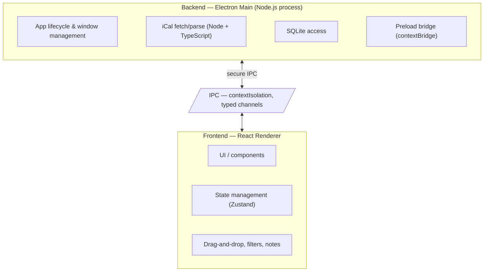

# CourseFlow

A desktop homework tracker that solves the limitations of Canvas's to-do app.

## What is CourseFlow?

Canvas is one of the largest edTech platforms across North American universities. CourseFlow is a desktop app that acts as a homework tracker, solving many of the limitations in Canvas's to-do app.

## Core Features

### 1. Custom Priority Ordering

Assignments in Canvas are listed in chronological order only. CourseFlow allows users to re-order the list according to their own priorities — focus on what matters most to you, not just what's due next.

### 2. Superior UX & Ease of Use

Unlike Canvas, which crams the to-do list into a small sidebar component, CourseFlow offers a dedicated, smooth UI — a convenience layer built specifically for students. The process of marking assignments as "done" is simpler, faster, and more satisfying.

### 3. Sub-tasks & Assignment Notes

Go beyond simple tracking. Break assignments into sub-tasks and add detailed notes about your progress. Use CourseFlow as a productivity app to log what you've been working on, not just what's due.

> **Status:** Complete (Phase 3). Sub-tasks and notes are fully integrated into the assignment detail view with full CRUD support.

### 4. Standalone Notes & Pages (Notion-style)

Create notes and pages independently — not tied to any assignment. Organize with a collapsible sidebar, nested pages, and rich text/markdown editing. Use CourseFlow as your personal knowledge base for class notes, project planning, or anything else.

> **Status:** Planned for Phase 3+. Backend schema and IPC will be extended to support a `pages` table with hierarchical structure (parent/child), rich content blocks, and full-text search.

## Platform & Data

- **Cross-platform**: Built on Electron, CourseFlow runs on Windows, macOS, and Linux — no browser tab required.
- **100% local**: All data is stored locally in SQLite. Your data does NOT go to the cloud.
- **Sync**: Pull your latest assignments from any **iCal feed** (Google Calendar, Canvas, Outlook, etc.), keeping your list up to date. The MVP syncs a single feed; multi-calendar support is planned (Phase 6).

## Tech Stack

| Component            | Technology     | Notes                                                                                    |
| -------------------- | -------------- | ---------------------------------------------------------------------------------------- |
| Desktop Framework    | **Electron**   | Cross-platform desktop app (Windows, macOS, Linux)                                       |
| Calendar Integration | **iCal**       | Generic iCal feed importer (Google Calendar, Canvas, Outlook, …); single feed in the MVP |
| Backend              | **TypeScript** | Best support for working with iCal                                                       |
| Frontend             | **React**      | Modern, responsive desktop UI                                                            |
| Database             | **SQLite**     | Local data storage                                                                       |

## Architecture

The app follows a **backend/frontend** architecture within Electron's two-process model:



- **Backend (Electron Main + Preload + Shared)** handles all Node.js/Electron APIs: app lifecycle, window management, fetching/parsing the Canvas iCal feed, SQLite database access, the secure `contextBridge` preload script, and shared TypeScript types/utilities (IPC contracts, domain types) used by both processes.
- **Frontend (React Renderer)** is the UI layer — components, state, and interactions — kept sandboxed behind `contextIsolation` with no direct access to Node/Electron APIs.
- **IPC** is the only communication channel between backend and frontend, using typed channels defined in `src/backend/shared/ipc.ts`.
- **Shared** (inside `src/backend/shared/`) contains pure TypeScript types/utilities used by both backend and frontend (no Electron/Node dependencies).

## Roadmap

> **Status:** Phases 1–3 shipped and verified. Phase 4 (Launch) in progress.

### ✅ v0.1 — MVP (done)

- Import a single iCal feed into a local SQLite assignment list
- Display assignments in a chronological list
- Mark assignments as done (persisted)

### ✅ v0.2 — Priority & Organization (done)

- Re-order assignments by personal priority (drag-and-drop + keyboard)
- Filter, sort, and group views (This Week / Overdue / Upcoming / Completed / By Course)
- Background auto-sync scheduler with manual "Sync Now"

### ✅ v0.3 — Productivity Depth (done)

- Assignment detail view with expandable cards
- Break assignments into sub-tasks with full CRUD support
- Add notes and log progress per assignment with timestamps
- Progress indicators showing sub-task completion status
- Fully keyboard-accessible detail view — see [docs/architecture/accessibility.md](docs/architecture/accessibility.md)

### v0.4 — Polish & Multi-Calendar (In Progress)

- **Multi-calendar support** — Manage N iCal feeds (Google Calendar, Canvas, Outlook, Birthdays, family calendars, etc.) with per-feed sync state, color badges, and unified assignment list
- **Pomodoro timer** — Built-in focus timer with configurable work/break intervals
- **Notes graph visualization** — Visual rendering of the page hierarchy (node tree representing the file structure of notes)
- Per-source sync status in TopBar; manage calendars in Settings (add/remove/name/color/enable)

### v1.0 — Launch

- Polished, dedicated desktop UI
- Cross-platform packaging for Windows, macOS, and Linux (electron-builder NSIS / DMG / AppImage)
- Reliable iCal syncing and refresh
- Auto-updater support

### Later (Post-Launch)

- Due-date reminders and notifications
- Optional cloud backup *

*<small>Backup details and pricing are still being decided.</small>

## Getting Started

### Prerequisites

- Node.js 24 LTS (pinned in `.node-version`, managed via [fnm](https://github.com/Schniz/fnm))
- pnpm (install globally: `npm install -g pnpm`)

### Installation

```bash
pnpm install
```

### Development

```bash
# Start dev server with hot reload
pnpm dev

# Run type checking
pnpm typecheck

# Run linter
pnpm lint

# Format code
pnpm format

# Run tests
pnpm test
```

### Testing

```bash
# Unit / component tests (single fork per the project test guidelines)
pnpm test -- --pool=forks --poolOptions.forks.singleFork

# Unit / component tests in watch mode
pnpm test:watch

# End-to-end tests (Playwright; starts the dev server automatically)
pnpm test:e2e

# Accessibility-only E2E scan
pnpm test:e2e -- accessibility.playwright.ts
```

> Always run tests with limited concurrency (`--pool=forks --poolOptions.forks.singleFork`)
> and clean up any orphaned processes afterwards. See `.github/copilot-instructions.md`.

### Building

```bash
# Build for production
pnpm build

# Preview production build
pnpm preview
```

### Project Structure

```
src/
  backend/       # Backend (Electron Main + Preload)
    main/        # Main process (Node + Electron APIs)
    preload/     # Preload scripts (contextBridge)
    shared/      # Pure TS shared types/utilities (no Electron/Node deps)
  frontend/      # Frontend (React + Vite)
    src/         # React source
    index.html   # Vite entry HTML
```

_Coming soon — installation and setup instructions._

## License

_To be determined._
