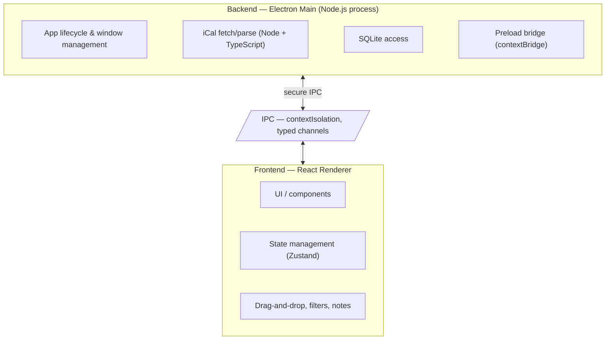

# CourseFlow

A desktop homework tracker that solves the limitations of Canvas's to-do app.

## What is CourseFlow?

Canvas is one of the largest edTech platforms across North American universities. CourseFlow is a desktop app that acts as a homework tracker, solving many of the limitations in Canvas's to-do app.

## Core Features

### 1. Custom Priority Ordering

Assignments in Canvas are listed in chronological order only. CourseFlow allows users to re-order the list according to their own priorities — focus on what matters most to you, not just what's due next.

### 2. Superior UX & Ease of Use

Unlike Canvas, which crams the to-do list into a small sidebar component, CourseFlow offers a dedicated, smooth UI — a convenience layer built specifically for students. The process of marking assignments as "done" is simpler, faster, and more satisfying.

### 3. Sub-tasks & Note-Taking

Go beyond simple tracking. Break assignments into sub-tasks and add detailed notes about your progress. Use CourseFlow as a productivity app to log what you've been working on, not just what's due.

## Platform & Data

- **Cross-platform**: Built on Electron, CourseFlow runs on Windows, macOS, and Linux — no browser tab required.
- **100% local**: All data is stored locally in SQLite. Your data does NOT go to the cloud.
- **Sync**: Pull your latest assignments directly from the Canvas Calendar via iCal, keeping your list up to date.

## Tech Stack

| Component            | Technology     | Notes                                              |
| -------------------- | -------------- | -------------------------------------------------- |
| Desktop Framework    | **Electron**   | Cross-platform desktop app (Windows, macOS, Linux) |
| Calendar Integration | **iCal**       | Pulls data directly from the Canvas Calendar       |
| Backend              | **TypeScript** | Best support for working with iCal                 |
| Frontend             | **React**      | Modern, responsive desktop UI                      |
| Database             | **SQLite**     | Local data storage                                 |

## Architecture

The app follows a **backend/frontend** architecture within Electron's two-process model:



- **Backend (Electron Main + Preload + Shared)** handles all Node.js/Electron APIs: app lifecycle, window management, fetching/parsing the Canvas iCal feed, SQLite database access, the secure `contextBridge` preload script, and shared TypeScript types/utilities (IPC contracts, domain types) used by both processes.
- **Frontend (React Renderer)** is the UI layer — components, state, and interactions — kept sandboxed behind `contextIsolation` with no direct access to Node/Electron APIs.
- **IPC** is the only communication channel between backend and frontend, using typed channels defined in `src/backend/shared/ipc.ts`.
- **Shared** (inside `src/backend/shared/`) contains pure TypeScript types/utilities used by both backend and frontend (no Electron/Node dependencies).

## Roadmap

### v0.1 — MVP

- Parse the Canvas iCal calendar feed
- Display assignments in a chronological list
- Mark assignments as done

### v0.2 — Priority & Organization

- Re-order assignments by personal priority (drag-and-drop)
- Filter and sort views

### v0.3 — Productivity Depth

- Break assignments into sub-tasks
- Add notes and log your progress

### v1.0 — Launch

- Polished, dedicated desktop UI
- Cross-platform packaging for Windows, macOS, and Linux
- Reliable iCal syncing and refresh

### Later

- Due-date reminders and notifications
- Optional cloud backup *

*<small>Backup details and pricing are still being decided.</small>

## Getting Started

### Prerequisites

- Node.js 24 LTS (pinned in `.node-version`, managed via [fnm](https://github.com/Schniz/fnm))
- pnpm (install globally: `npm install -g pnpm`)

### Installation

```bash
pnpm install
```

### Development

```bash
# Start dev server with hot reload
pnpm dev

# Run type checking
pnpm typecheck

# Run linter
pnpm lint

# Format code
pnpm format

# Run tests
pnpm test
```

### Building

```bash
# Build for production
pnpm build

# Preview production build
pnpm preview
```

### Project Structure

```
src/
  backend/       # Backend (Electron Main + Preload)
    main/        # Main process (Node + Electron APIs)
    preload/     # Preload scripts (contextBridge)
    shared/      # Pure TS shared types/utilities (no Electron/Node deps)
  frontend/      # Frontend (React + Vite)
    src/         # React source
    index.html   # Vite entry HTML
```

_Coming soon — installation and setup instructions._

## License

_To be determined._
