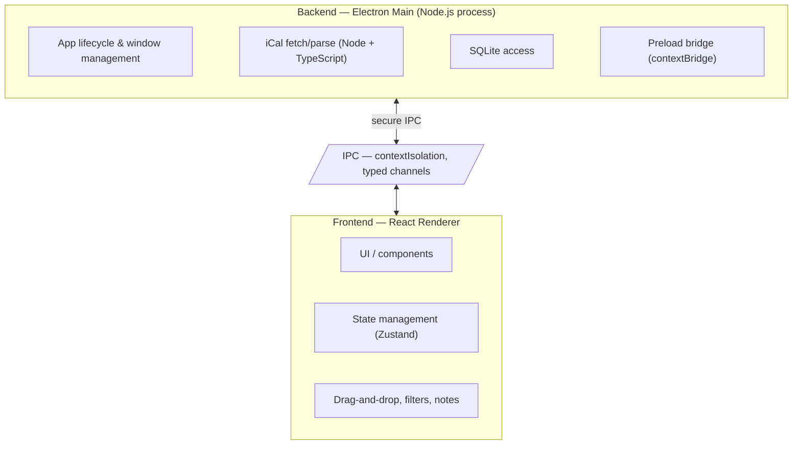

# CourseFlow — Implementation Plan

> **Note:** This document outlines the high-level implementation plan. Granular task breakdown lives in the `tickets/` folder and will be filled in as we plan each phase.

## Overview

CourseFlow is a desktop homework tracker built with **Electron + React + TypeScript + SQLite**, pulling assignment data from **any iCal feed** (Google Calendar, Canvas, Outlook, etc.) via iCal. The app runs 100% locally by default.

### Principles

- **Local-first** — all data lives in SQLite on the user's machine.
- **Simple + fast UX** — marking things done, re-ordering, and note-taking should feel effortless.
- **Single source of truth** — the iCal feed is the source for assignments; local data augments it (priority order, sub-tasks, notes).

## Status (Sep 2026)

- **Phase 0–2 complete** — tracked MVP is functional and verified: single-feed iCal import (past 30d / next 60d window, recurring + all-day events), local SQLite list, priority ordering, filters/sort/group, and a background auto-sync scheduler.
- **Phase 3 in progress** — see `docs/tickets/phase3/README.md` (detail view, sub-tasks, notes UI; backend already exists).
- The app currently syncs **one** iCal feed; multi-calendar support is planned for Phase 6.

## Phase 0 — Foundation (scaffold) ✅ Complete

Lay the project skeleton and prove the core toolchain works end-to-end.

- Set up Electron + React + TypeScript project (Vite + electron tooling).
- Configure SQLite database layer (schema, migrations).
- Establish app architecture: **backend (main + preload + shared) / frontend (renderer)** split.
- Decide package manager + Node version (recommended: **Node.js 24 LTS**).
- CI/lint/format baseline.

## Phase 1 — MVP (tracking assignments) ✅ Complete

Deliver a functional tracker with the minimum viable feature set.

- Fetch and parse an **iCal** calendar feed (single feed; Google Calendar, Canvas, Outlook, etc.).
- Store assignments in SQLite.
- Render a chronological assignment list.
- Mark assignments as "done" with instant feedback.
- Handle feed configuration (iCal URL input, encrypted at rest).

## Phase 2 — Priority & Organization ✅ Complete

Give users control over how their list is ordered and viewed.

- Drag-and-drop re-ordering of assignments (custom priority).
- Persist priority order locally.
- Filtering (by course, due date, status) and sorting.
- Basic grouping (e.g., "This week", "Overdue", "Done").
- Background auto-fetch scheduler (configurable interval, retry/backoff, manual "Sync Now").

## Phase 3 — Productivity Depth 🚧 In Progress

Turn CourseFlow from a tracker into a productivity tool.

- Break assignments into **sub-tasks**.
- Add **notes** and progress logging per assignment.
- **Standalone notes & pages** — Create notes and pages independently (like Notion), not tied to any assignment. Organize with a sidebar, nested pages, and rich text/markdown support with full-text search.
- Link sub-tasks/notes to the assignment in the DB.
- UI for the above (expandable assignment cards / detail view + dedicated Notes workspace).

## Phase 4 — Polish & Cross-Platform

Get ready for a public launch.

- Polished, dedicated desktop UI and interactions.
- Cross-platform packaging (Windows, macOS, Linux) via Electron Builder.
- Graceful handling of feed sync errors / offline.
- Performance and stability pass.
- **Optional:** cloud backup behind a paid tier (details/pricing TBD).

## Phase 5 — Later (post-launch ideas)

- Due-date reminders / notifications.
- Auto-refresh of the calendar feed.
- Potential for a recurring-event sync with Canvas.

## Phase 6 (Planned) — Multi-Calendar Unified View

> **Status:** Planned. The app currently supports exactly **one** iCal feed URL
> (`settings.icalUrl`). This phase replaces that with **N feeds** (Google
> Calendar primary + Birthdays + a Canvas feed, Outlook, family calendars, etc.)
> and renders a single unified assignment list with per-calendar attribution.

Planned scope:

- **Calendar sources** — a first-class `calendars` entity: id, display name,
  feed URL (encrypted), enabled flag, optional accent color, per-calendar sync
  state (last sync / next sync / last error), and order.
- **Import/export semantics** — mapper window (past 30d / next 60d) and RRULE
  expansion stay the same, but **dedupe & prune become per-source** (the current
  `importAssignments` prune is global across all `ical` rows and must be scoped
  by source before enabling multiple feeds).
- **Scheduler** — iterates every enabled source; per-feed retry/backoff,
  progress events, and per-source `lastSyncAt`; a failure on one feed never
  blocks the others.
- **UI** — manage calendars in Settings (add/remove/name/color/enable), unified
  list with a source/course filter and color badges, per-source sync status in
  the TopBar.
- **Migration** — a `calendars` table + `assignments.source_id` FK (existing
  `source_url` already points at the feed URL, which gives us a backwards-
  compatible path); the old single `icalUrl` setting becomes one seeded
  calendar row.

Detailed design + data model/decision record: `docs/architecture/multi-calendar.md`.

## Architecture (high level)

The app follows a **backend/frontend** architecture within Electron's two-process model:

- **Backend (Electron Main + Preload + Shared)** handles all Node.js/Electron APIs: app lifecycle, window management, fetching/parsing the Canvas iCal feed, SQLite database access, the secure `contextBridge` preload script, and shared TypeScript types/utilities (IPC contracts, domain types) used by both processes.
- **Frontend (React Renderer)** is the UI layer — components, state, and interactions — kept sandboxed behind `contextIsolation` with no direct access to Node/Electron APIs.
- **IPC** is the only communication channel between backend and frontend, using typed channels defined in `src/backend/shared/ipc.ts`.
- **Shared** (inside `src/backend/shared/`) contains pure TypeScript types/utilities used by both backend and frontend (no Electron/Node dependencies).

### Data model (initial)

- **Assignments** — id, title, course, due_date, status (pending/done), source_id (from iCal)
- **PriorityOrder** — assignment_id → position
- **SubTasks** — assignment_id, title, done
- **Notes** — assignment_id, content, created_at

## Key Decisions & Open Questions

- [x] Finalize SQLite schema details during Phase 0.
- [x] iCal feed interaction: **full re-pull** on every sync (schedule-driven, with upsert + prune) — chosen over incremental sync for MVP simplicity.
- [x] Choose drag-and-drop library (renderer): **@dnd-kit**.
- [ ] Determine cloud backup scope + pricing model (deferred to Phase 4).
- [x] Decide whether sync is manual, on-launch, or scheduled: manual "Sync Now" + configurable background scheduler (Phase 2).
- [ ] Single feed vs. multiple calendars → **multiple feeds planned (Phase 6)**, see `docs/architecture/multi-calendar.md`.

## Milestones

| Milestone | Phase        | Exit Criteria                                      |
| --------- | ------------ | -------------------------------------------------- |
| M0        | Foundation   | Scafolded app runs, DB schema migrates cleanly     |
| M1        | MVP          | User can add iCal feed, see assignments, mark done |
| M2        | Priority     | Re-ordering persists and maps to priority views    |
| M3        | Productivity | Sub-tasks + notes usable per assignment            |
| M4        | Launch       | Packaged installers, tested on 3 OSes              |
