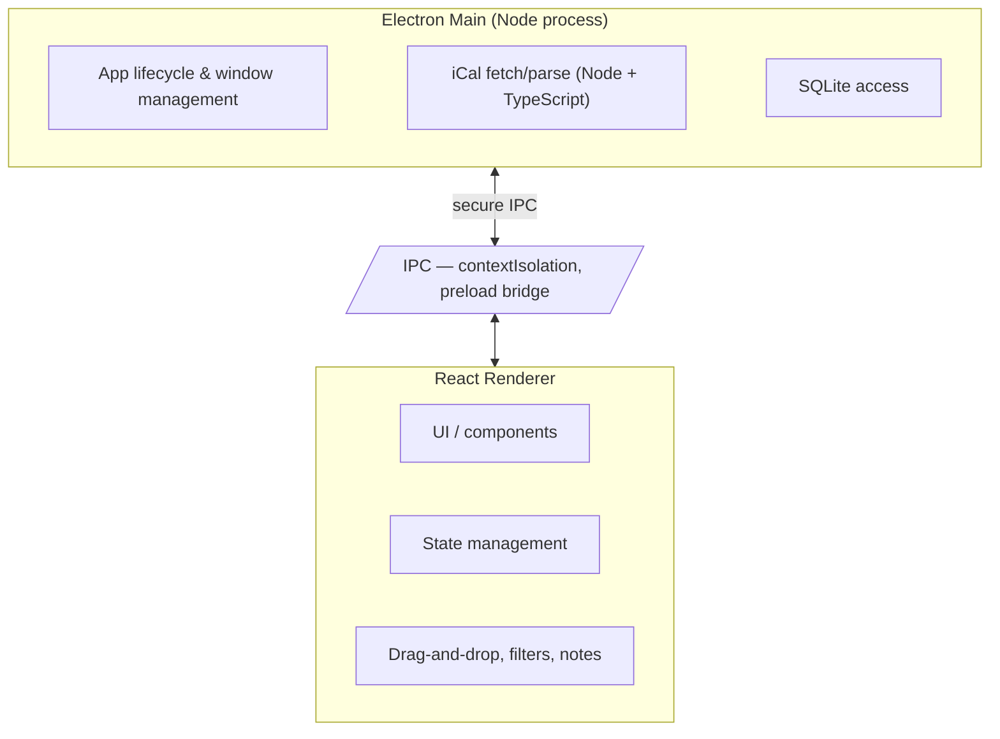

# CourseFlow — Implementation Plan

> **Note:** This document outlines the high-level implementation plan. Granular task breakdown lives in the `tickets/` folder and will be filled in as we plan each phase.

## Overview

CourseFlow is a desktop homework tracker built with **Electron + React + TypeScript + SQLite**, pulling assignment data from the Canvas Calendar via **iCal**. The app runs 100% locally by default.

### Principles

- **Local-first** — all data lives in SQLite on the user's machine.
- **Simple + fast UX** — marking things done, re-ordering, and note-taking should feel effortless.
- **Single source of truth** — the iCal feed is the source for assignments; local data augments it (priority order, sub-tasks, notes).

## Phase 0 — Foundation (scaffold)

Lay the project skeleton and prove the core toolchain works end-to-end.

- Set up Electron + React + TypeScript project (Vite + electron tooling).
- Configure SQLite database layer (schema, migrations).
- Establish app architecture: main process / preload / renderer split.
- Decide package manager + Node version (recommended: **Node.js 20 LTS**).
- CI/lint/format baseline.

## Phase 1 — MVP (tracking assignments)

Deliver a functional tracker with the minimum viable feature set.

- Fetch and parse the Canvas **iCal** calendar feed.
- Store assignments in SQLite.
- Render a chronological assignment list.
- Mark assignments as "done" with instant feedback.
- Handle feed configuration (iCal URL input).

## Phase 2 — Priority & Organization

Give users control over how their list is ordered and viewed.

- Drag-and-drop re-ordering of assignments (custom priority).
- Persist priority order locally.
- Filtering (by course, due date, status) and sorting.
- Basic grouping (e.g., "This week", "Overdue", "Done").

## Phase 3 — Productivity Depth

Turn CourseFlow from a tracker into a productivity tool.

- Break assignments into **sub-tasks**.
- Add **notes** and progress logging per assignment.
- Link sub-tasks/notes to the assignment in the DB.
- UI for the above (expandable assignment cards / detail view).

## Phase 4 — Polish & Cross-Platform

Get ready for a public launch.

- Polished, dedicated desktop UI and interactions.
- Cross-platform packaging (Windows, macOS, Linux) via Electron Builder.
- Graceful handling of feed sync errors / offline.
- Performance and stability pass.
- **Optional:** cloud backup behind a paid tier (details/pricing TBD).

## Phase 5 — Later (post-launch ideas)

- Due-date reminders / notifications.
- Auto-refresh of the calendar feed.
- Potential for a recurring-event sync with Canvas.

## Architecture (high level)

### Data model (initial)

- **Assignments** — id, title, course, due_date, status (pending/done), source_id (from iCal)
- **PriorityOrder** — assignment_id → position
- **SubTasks** — assignment_id, title, done
- **Notes** — assignment_id, content, created_at

## Key Decisions & Open Questions

- [ ] Finalize SQLite schema details during Phase 0.
- [ ] Determine iCal feed interaction: full re-pull vs. incremental sync.
- [ ] Choose drag-and-drop library (renderer).
- [ ] Determine cloud backup scope + pricing model (deferred to Phase 4).
- [ ] Decide whether sync is manual, on-launch, or scheduled.

## Milestones

| Milestone | Phase | Exit Criteria |
|-----------|-------|---------------|
| M0 | Foundation | Scafolded app runs, DB schema migrates cleanly |
| M1 | MVP | User can add iCal feed, see assignments, mark done |
| M2 | Priority | Re-ordering persists and maps to priority views |
| M3 | Productivity | Sub-tasks + notes usable per assignment |
| M4 | Launch | Packaged installers, tested on 3 OSes |