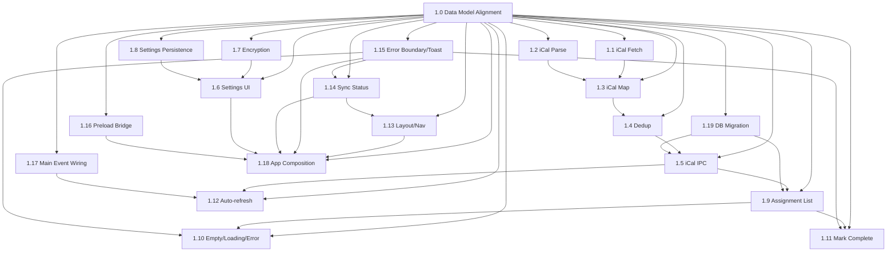

# Phase 1 — MVP (Tracking Assignments)

> **Goal:** Deliver a functional homework tracker with the minimum viable feature set — fetch/parse Canvas iCal, store assignments in SQLite, render a chronological list, and mark assignments as "done."
>
> **Exit Criteria:** A user can enter their Canvas iCal URL, fetch assignments, see them in a chronological list, and mark them complete — all persisting locally in SQLite.

---

## Overview

Phase 1 builds on the Phase 0 foundation (scaffold, database, IPC, typed bridge) to implement the core Canvas integration and assignment tracking loop:

1. **Configure** → User enters their Canvas iCal URL in settings
2. **Fetch** → App pulls the iCal feed from Canvas Calendar
3. **Parse** → iCal events are converted to `Assignment` entities
4. **Store** → Assignments saved to SQLite (deduplicated by iCal UID)
5. **Display** → Chronological list rendered in React frontend
6. **Act** → User marks assignments done; state persists instantly

---

## Phase 1 Scope — What Needs to Be Done

### ⚠️ BLOCKING PREREQUISITE (Do First)

| #   | Ticket ID                        | Title                    | Description                                                                                                                                         |
| --- | -------------------------------- | ------------------------ | --------------------------------------------------------------------------------------------------------------------------------------------------- |
| 1.0 | `phase1-00-data-model-alignment` | **Data Model Alignment** | Extend shared types, IPC contracts, database schema, and repository mappers to match full Phase 1 data model. **All other tickets depend on this.** |

### A. iCal Integration (Backend)

| #   | Ticket ID              | Title                                     | Details                                                                                                                                                                                                                                                                |
| --- | ---------------------- | ----------------------------------------- | ---------------------------------------------------------------------------------------------------------------------------------------------------------------------------------------------------------------------------------------------------------------------- |
| 1.1 | `phase1-01-ical-fetch` | iCal Feed Fetch Utility                   | Add `fetchICalFeed(url: string): Promise<string>` in `src/backend/main/ical/` using native `fetch` with timeout, retry (exponential backoff, max 3), and proper error handling (network, 4xx, 5xx).                                                                    |
| 1.2 | `phase1-02-ical-parse` | iCal Parser (VEVENT → ICalEvent)          | Add `parseICalFeed(text: string): ICalEvent[]` using `ical.js` (npm) or lightweight custom parser. Must handle: `VEVENT` → `ICalEvent`, extract `UID`, `SUMMARY`, `DESCRIPTION`, `DTSTART`, `DTEND`, `RRULE`, `URL`, `CATEGORIES`, `LOCATION`.                         |
| 1.3 | `phase1-03-ical-map`   | iCal → Assignment Mapping & Deduplication | Transform `ICalEvent[]` → `AssignmentInput[]`: derive `courseId` from `CATEGORIES` or `SUMMARY`, `dueDate` from `DTSTART`, `source='ical'`, `sourceUrl` from `UID`/`URL`, `status='pending'`, `priority` from due date (sooner = higher). Deduplication by `ical_uid`. |
| 1.4 | `phase1-04-ical-dedup` | Deduplication Logic                       | On import, match by `ical_uid` (stored on Assignment). Update existing if `updated_at` newer; insert new. Return `{ imported: number; skipped: number; updated: number }`.                                                                                             |
| 1.5 | `phase1-05-ical-ipc`   | IPC Handlers for iCal                     | Implement `ical:fetch` and `ical:import` in `ipc-handlers.ts`. Emit `ical:progress` events (`fetch` → `parse` → `store`) for UI feedback.                                                                                                                              |

### B. Settings & iCal URL Management (Backend + Frontend)

| #   | Ticket ID                        | Title                | Details                                                                                                                                                                                  |
| --- | -------------------------------- | -------------------- | ---------------------------------------------------------------------------------------------------------------------------------------------------------------------------------------- |
| 1.6 | `phase1-06-settings-ui`          | Settings UI          | Build a Settings page/modal in React: input for iCal URL, "Fetch Now" button, auto-fetch interval dropdown, theme selector.                                                              |
| 1.7 | `phase1-07-ical-encryption`      | iCal URL Encryption  | Implement AES-GCM encryption for the iCal URL in the `settings` table per `docs/architecture/security.md`. Use Web Crypto API in Main process; store `{ ciphertext, iv, salt }` as JSON. |
| 1.8 | `phase1-08-settings-persistence` | Settings Persistence | Wire `settings:get` / `settings:set` / `settings:reset` IPC to the Settings UI. Load settings on app start; apply theme immediately.                                                     |

### C. Assignment List UI (Frontend)

| #    | Ticket ID                       | Title                          | Details                                                                                                                                                                        |
| ---- | ------------------------------- | ------------------------------ | ------------------------------------------------------------------------------------------------------------------------------------------------------------------------------ |
| 1.9  | `phase1-09-assignment-list`     | Assignment List Component      | Build `AssignmentList` component: fetch via `window.api.db.assignments.list()`, render chronologically (by `dueDate`), show course color badge, title, due date, status badge. |
| 1.10 | `phase1-10-empty-loading-error` | Empty / Loading / Error States | Show skeleton loaders while fetching; empty state with "Add iCal URL in Settings" CTA; error toast for fetch/parse failures.                                                   |
| 1.11 | `phase1-11-mark-complete`       | Mark Complete Interaction      | Click checkbox/btn → `window.api.db.assignments.upsert({ ...status: 'completed' })` → optimistic UI update → toast confirmation.                                               |
| 1.12 | `phase1-12-auto-refresh`        | Auto-refresh on DB Changes     | Subscribe to `window.api.onDbChanged` → re-fetch list when `assignments` table changes.                                                                                        |

### D. App Shell & Navigation (Frontend)

| #    | Ticket ID                        | Title                         | Details                                                                                                 |
| ---- | -------------------------------- | ----------------------------- | ------------------------------------------------------------------------------------------------------- |
| 1.13 | `phase1-13-layout-navigation`    | Layout / Navigation           | Top bar with app title, sync status indicator, settings gear icon. Responsive layout (min-width 800px). |
| 1.14 | `phase1-14-sync-status`          | Sync Status Indicator         | Show last sync time, next auto-sync countdown, manual "Sync Now" button with spinner.                   |
| 1.15 | `phase1-15-error-boundary-toast` | Error Boundary + Toast System | Global error boundary; toast notifications for iCal fetch errors, DB errors, network issues.            |

### E. Infrastructure & Integration (New Tickets)

| #    | Ticket ID                          | Title                     | Details                                                                                                                               |
| ---- | ---------------------------------- | ------------------------- | ------------------------------------------------------------------------------------------------------------------------------------- |
| 1.16 | `phase1-16-preload-bridge-updates` | Preload Bridge Updates    | Verify/extend `src/backend/preload/index.ts` to expose all updated IPC channels from Ticket 1.0.                                      |
| 1.17 | `phase1-17-main-event-wiring`      | Main Process Event Wiring | Ensure `db:changed`, `ical:progress`, `settings:changed` events emitted correctly after all CRUD operations.                          |
| 1.18 | `phase1-18-app-composition`        | App Composition           | Compose `App.tsx` with `ErrorBoundary`, `ToastProvider`, `Layout`, routing (`AssignmentListPage`, `SettingsPage`), theme application. |
| 1.19 | `phase1-19-database-migration`     | Database Migration v2     | Create and run migration to add all missing columns to `assignments` and `settings` tables.                                           |
| 1.20 | `phase1-20-auto-fetch-scheduler`   | Auto-fetch Scheduler      | **[DEFERRED TO PHASE 2]** Background scheduler for periodic iCal fetch. Phase 1 includes UI countdown and manual sync only.           |

---

## Non-Coding Actions (Outside Writing Feature Code)

> These are often blockers or prerequisites for the coding work above.

### Environment & Dependencies

- [ ] **Add `ical.js` dependency** — `pnpm add ical.js @types/ical.js` (or evaluate lighter alternatives like `node-ical`).
- [ ] **Verify Web Crypto availability** — Node 24 has full Web Crypto; confirm `crypto.subtle` works in Electron Main context.
- [ ] **Test iCal feed samples** — Obtain real Canvas iCal URLs (or mock `.ics` files) to validate parsing against real data (recurring events, all-day events, HTML descriptions, timezone handling).

### Architecture & Design Decisions (Resolve Before Coding)

- [ ] **Timezone handling** — Canvas iCal feeds use UTC (`DTSTART:20251015T235900Z`). Decide: store as UTC ISO strings; display in user's local timezone in UI. Document in `docs/architecture/data-model.md`.
- [ ] **Recurring events (RRULE)** — Canvas uses recurring events for repeating assignments. Decide MVP approach: (a) expand RRULE into individual occurrences on import (complex), (b) store RRULE on Assignment and expand in UI only (simpler), (c) ignore RRULE for MVP, only import non-recurring. **Recommendation:** (b) for MVP — store RRULE, expand in UI later.
- [ ] **Course extraction heuristic** — Canvas iCal `CATEGORIES` often contains course codes (e.g., `CS101`). Fallback: parse from `SUMMARY` prefix (e.g., `[CS101] Homework 1`). Define and document the heuristic.
- [ ] **Auto-fetch scheduling** — Use `setInterval` in Main process? Or `electron-util`'s `schedule`? **Deferred to Phase 2** — Phase 1 has UI countdown only.
- [ ] **Conflict resolution on re-import** — If user edits an assignment locally (e.g., adds notes) then re-syncs, how to merge? **MVP:** Never overwrite local `description`, `notes`, `subtasks`, `priority` on re-import — only update `dueDate`, `title`, `workflow_state` from Canvas.

### Product / Data

- [ ] **Validate data model against real iCal** — Confirm `Assignment` fields in `src/backend/shared/types.ts` capture all needed iCal data. Add missing fields if necessary (e.g., `rrule`, `location`).
- [ ] **Define "done" semantics** — `status: 'completed'` vs `archived`. MVP: `completed` hides from default list but keeps in DB; "Show Completed" toggle in UI.

### Process & Hygiene

- [ ] **Update root README** — Add "Current Phase: 1 (MVP)" badge and link to this doc.
- [ ] **Add Vitest tests** — Unit tests for iCal parser, mapper, deduplication logic; integration test for `ical:import` IPC handler.

---

## Deliverables Checklist

By the end of Phase 1:

### Backend (Main Process)

- [ ] `src/backend/main/ical/fetch.ts` — robust fetch with retry/timeout
- [ ] `src/backend/main/ical/parse.ts` — iCal → `ICalEvent[]`
- [ ] `src/backend/main/ical/map.ts` — `ICalEvent[]` → `AssignmentInput[]`
- [ ] `src/backend/main/ical/import.ts` — deduplication + DB upsert
- [ ] IPC handlers for `ical:fetch`, `ical:import` + progress events
- [ ] Settings encryption (AES-GCM) for `ical_url`

### Frontend (Renderer)

- [ ] Settings page/modal with iCal URL input, fetch button, theme, auto-sync interval
- [ ] Assignment list view (chronological, course color, due date, status)
- [ ] Mark complete interaction (optimistic + toast)
- [ ] Sync status indicator (last sync, next sync, manual sync button)
- [ ] Global toast/error boundary system
- [ ] Responsive layout with navigation

### Infrastructure

- [ ] Data model aligned across types, IPC, database, repository (Ticket 1.0)
- [ ] Database migration v2 applied (Ticket 1.19)
- [ ] Preload bridge matches IPC contracts (Ticket 1.16)
- [ ] Main process event emission complete (Ticket 1.17)
- [ ] App shell composed with all providers (Ticket 1.18)

### Integration

- [ ] End-to-end flow: Settings → enter iCal URL → Fetch → list renders → mark done → persists
- [ ] Manual "Sync Now" triggers fetch → import → list updates
- [ ] `db:changed` event propagation works for real-time UI updates
- [ ] Auto-fetch settings persisted; UI countdown works (scheduler deferred to Phase 2)

### Documentation

- [ ] Phase 1 tickets created in `docs/tickets/phase1/`
- [ ] `docs/architecture/data-model.md` updated with timezone/RRULE decisions
- [ ] Root README updated with current phase

---

## Ticket Dependency Graph

---

## Estimated Effort

| Category                                                     | Estimate       |
| ------------------------------------------------------------ | -------------- |
| Data Model Alignment (Ticket 1.0)                            | 1 day          |
| Backend iCal pipeline (fetch, parse, map, import, IPC)       | 2–3 days       |
| Settings encryption + UI                                     | 1 day          |
| Frontend assignment list + interactions                      | 2 days         |
| App shell, navigation, toasts, error handling                | 1 day          |
| Infrastructure (migration, preload, events, app composition) | 1 day          |
| Integration, testing, polish                                 | 1–2 days       |
| **Total**                                                    | **~9–11 days** |

---

## Risks & Mitigations

| Risk                                                        | Likelihood | Impact   | Mitigation                                                                                    |
| ----------------------------------------------------------- | ---------- | -------- | --------------------------------------------------------------------------------------------- |
| iCal parsing edge cases (timezones, RRULE, malformed feeds) | High       | High     | Start with real Canvas `.ics` samples; use battle-tested `ical.js`; write parser tests first. |
| Web Crypto subtle API differences in Electron Main          | Low        | Medium   | Test encryption/decryption round-trip early; fallback to `node:crypto` if needed.             |
| sql.js WASM performance with large assignment lists         | Low        | Low      | MVP expects <500 assignments; `sql.js` handles this easily. Monitor.                          |
| Canvas iCal URL changes / auth expiry                       | Medium     | Medium   | Store URL encrypted; show clear error toast on 401/403; allow re-entry in Settings.           |
| Recurring event expansion complexity                        | Medium     | High     | Defer full RRULE expansion to Phase 2; store RRULE string for now.                            |
| **Data model mismatch (Phase 0 vs Phase 1 tickets)**        | **High**   | **High** | **Ticket 1.0 addresses this explicitly — run first.**                                         |

---

## Next Phase Preview (Phase 2)

- Drag-and-drop priority reordering (persist to `priority_order` table)
- Filtering (by course, due date, status) and sorting
- Grouping views ("This Week", "Overdue", "Completed")
- Keyboard shortcuts for power users
- **Background auto-fetch scheduler** (Ticket 1.20)

---

## References

- `docs/roadmap.md` — High-level roadmap
- `docs/architecture/data-model.md` — Data model decisions
- `docs/architecture/ipc-contract.md` — IPC channel definitions
- `docs/architecture/process-model.md` — Electron process architecture
- `docs/architecture/security.md` — Encryption requirements
- `docs/tickets/phase1/` — Individual ticket files
