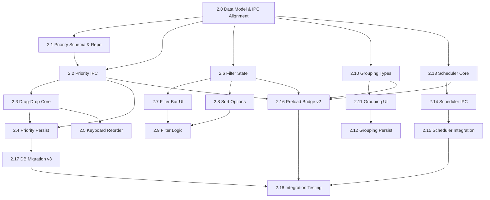

# Phase 2 — Priority & Organization

> **Goal:** Give users full control over how their assignment list is ordered and viewed — drag-and-drop custom priority, powerful filtering/sorting, and smart grouping views — while adding background auto-fetch to keep data fresh.
>
> **Exit Criteria:** A user can re-order assignments by personal priority (persisted across restarts), filter and sort the list by multiple criteria, toggle between grouped views ("This Week", "Overdue", "Completed"), and the app automatically syncs the iCal feed on a configurable interval in the background.

---

## Overview

Phase 2 builds on the Phase 1 MVP (fetch/parse/store/display/mark-done) to deliver the **core differentiator** of CourseFlow: **personal priority ordering** — the ability to re-order assignments independently of due dates, plus the viewing tools to make that ordering useful.

### User Journey in Phase 2

1. **Prioritize** → Drag assignments into a custom order that reflects _your_ workflow, not Canvas's chronology.
2. **Persist** → Order survives app restarts, syncs, and re-imports (local priority never overwritten by Canvas).
3. **Filter & Sort** → Narrow the list by course, due date range, status (pending/completed), or search text.
4. **Group** → Switch between flat list and grouped views: "This Week", "Overdue", "Upcoming", "Completed".
5. **Auto-Sync** → Background scheduler fetches the iCal feed on a configurable interval; manual "Sync Now" still available.

---

## Phase 2 Scope — What Needs to Be Done

### ⚠️ BLOCKING PREREQUISITE (Do First)

| #   | Ticket ID                     | Title                          | Description                                                                                                                                                                    |
| --- | ----------------------------- | ------------------------------ | ------------------------------------------------------------------------------------------------------------------------------------------------------------------------------ |
| 2.0 | `phase2-00-data-model-update` | **Data Model & IPC Alignment** | Extend shared types, IPC contracts, database schema, and repository mappers for Phase 2 entities (PriorityOrder, FilterState, Grouping). **All other tickets depend on this.** |

### A. Priority Ordering (Backend + Frontend)

| #   | Ticket ID                     | Title                            | Details                                                                                                                                                                                                             |
| --- | ----------------------------- | -------------------------------- | ------------------------------------------------------------------------------------------------------------------------------------------------------------------------------------------------------------------- |
| 2.1 | `phase2-01-priority-schema`   | Priority Order Schema & Repo     | Add `priority_order` table (FK → `assignments.id`, `position` INTEGER). Extend repository with `getPriorityOrder()`, `reorderPriority(ids: string[])`, `upsertPriority(assignmentId, position)`.                    |
| 2.2 | `phase2-02-priority-ipc`      | IPC Handlers for Priority        | Implement `db:priority:list`, `db:priority:reorder`, `db:priority:upsert` in `ipc-handlers.ts`. Emit `db:changed` for `priority_order` table.                                                                       |
| 2.3 | `phase2-03-drag-drop-core`    | Drag-and-Drop Core (Frontend)    | Implement drag-and-drop reordering in `AssignmentList` using `@dnd-kit/core` (or native HTML5 DnD). Optimistic UI: update local Zustand store immediately, call `db:priority:reorder` on drop.                      |
| 2.4 | `phase2-04-priority-persist`  | Priority Persistence & Hydration | On app load, hydrate assignment list sorted by `priority_order.position` (fallback: due date). On iCal re-import, **never overwrite** local priority — only update `due_at`, `title`, `workflow_state` from Canvas. |
| 2.5 | `phase2-05-priority-keyboard` | Keyboard Reordering              | Add keyboard shortcuts: `Alt+Up/Down` to move assignment up/down, `Alt+Shift+Up/Down` to move to top/bottom. Announce changes via screen reader (ARIA live region).                                                 |

### B. Filtering, Sorting & Search (Frontend)

| #   | Ticket ID                | Title                             | Details                                                                                                                                                                                            |
| --- | ------------------------ | --------------------------------- | -------------------------------------------------------------------------------------------------------------------------------------------------------------------------------------------------- |
| 2.6 | `phase2-06-filter-state` | Filter State Management (Zustand) | Add `FilterState` slice to Zustand store: `courseFilter: string[]`, `statusFilter: 'all' \| 'pending' \| 'completed'`, `dueDateRange: { start: Date; end: Date } \| null`, `searchQuery: string`.  |
| 2.7 | `phase2-07-filter-ui`    | Filter Bar UI                     | Build `FilterBar` component: multi-select course chips, status tabs (All/Pending/Completed), date range picker, search input with debounce. Persist filter state to `localStorage`.                |
| 2.8 | `phase2-08-sort-options` | Sort Options                      | Add sort dropdown: "Priority (custom)", "Due Date (asc)", "Due Date (desc)", "Course (A–Z)", "Created (newest)". Default = Priority. Persist sort preference.                                      |
| 2.9 | `phase2-09-filter-logic` | Filter/Sort Application Logic     | Derive filtered/sorted list in a memoized selector. Apply: search → course filter → status filter → date range → sort. Handle large lists efficiently (virtualization not required for MVP scale). |

### C. Grouped Views (Frontend)

| #    | Ticket ID                    | Title                      | Details                                                                                                                                                                                     |
| ---- | ---------------------------- | -------------------------- | ------------------------------------------------------------------------------------------------------------------------------------------------------------------------------------------- |
| 2.10 | `phase2-10-grouping-types`   | Grouping Type Definitions  | Define `GroupingType`: `'none' \| 'week' \| 'status' \| 'course'`. "This Week" = due in next 7 days; "Overdue" = due < now & pending; "Upcoming" = due > 7 days; "Completed" = status done. |
| 2.11 | `phase2-11-grouping-ui`      | Grouping Selector & Render | Add grouping selector to toolbar (icon + label). Render grouped list with collapsible section headers showing count. Within each group, respect current sort order.                         |
| 2.12 | `phase2-12-grouping-persist` | Grouping Persistence       | Persist selected grouping to `localStorage` (or settings table). Restore on app launch.                                                                                                     |

### D. Background Auto-Fetch Scheduler (Backend)

| #    | Ticket ID                         | Title                                  | Details                                                                                                                                                                                                               |
| ---- | --------------------------------- | -------------------------------------- | --------------------------------------------------------------------------------------------------------------------------------------------------------------------------------------------------------------------- |
| 2.13 | `phase2-13-scheduler-core`        | Scheduler Infrastructure               | Implement `src/backend/main/scheduler.ts`: `setInterval`-based scheduler in Main process. Configurable interval via `settings.sync_interval_minutes` (default: 15). Start/stop on app ready/quit.                     |
| 2.14 | `phase2-14-scheduler-ipc`         | Scheduler IPC & Events                 | Add `settings:syncIntervalChanged` event (emitted when interval updates). Scheduler emits `ical:progress` events during background fetch. Expose `scheduler:start`, `scheduler:stop` for testing.                     |
| 2.15 | `phase2-15-scheduler-integration` | Scheduler Integration & Error Handling | Wire scheduler to existing `ical:fetch` → `ical:import` pipeline. Handle errors gracefully: network failures → retry with backoff (max 3); 401/403 → toast "iCal URL invalid, check Settings"; don't crash scheduler. |

### E. Integration & Polish

| #    | Ticket ID                       | Title                          | Details                                                                                                                                                                                                |
| ---- | ------------------------------- | ------------------------------ | ------------------------------------------------------------------------------------------------------------------------------------------------------------------------------------------------------ |
| 2.16 | `phase2-16-preload-bridge-v2`   | Preload Bridge Updates         | Extend `src/backend/preload/index.ts` with all new IPC channels: priority, filter/sort (if backend filtering added later), scheduler controls.                                                         |
| 2.17 | `phase2-17-db-migration-v3`     | Database Migration v3          | Create and run migration to add `priority_order` table and any new indexes. Ensure migration is idempotent and runs on app startup.                                                                    |
| 2.18 | `phase2-18-integration-testing` | End-to-End Integration Testing | Verify full flow: drag-drop reorder → restart app → order persists → re-import iCal → priority preserved → filter/sort/group work → auto-sync runs in background → UI updates via `db:changed` events. |

---

## Non-Coding Actions (Outside Writing Feature Code)

> These are often blockers or prerequisites for the coding work above.

### Environment & Dependencies

- [ ] **Add `@dnd-kit/core` + `@dnd-kit/sortable` + `@dnd-kit/utilities`** — `pnpm add @dnd-kit/core @dnd-kit/sortable @dnd-kit/utilities` (modern, accessible drag-and-drop; lighter than react-beautiful-dnd).
- [ ] **Add date-fns (if not present)** — `pnpm add date-fns` for date range calculations in grouping logic (e.g., "This Week", "Overdue").
- [ ] **Verify scheduler behavior on sleep/wake** — Electron `power-monitor` events may need handling to avoid drift (defer if complex).

### Architecture & Design Decisions (Resolve Before Coding)

- [ ] **Priority initialization for new assignments** — When a new assignment arrives via iCal import, where does it go in the priority order? **Recommendation:** Append to end (lowest priority) so user can drag it up. Document in `docs/architecture/data-model.md`.
- [ ] **Priority conflict on re-import** — Phase 1 decided: never overwrite local `priority`, `notes`, `subtasks`, `description` on re-import. **Confirm this applies to `priority_order` table** — re-import should only upsert assignment fields, leave `priority_order` untouched.
- [ ] **Filter/sort: client-side vs server-side** — Current scale (<500 assignments) supports client-side filtering in Zustand selector. **Decision:** Client-side for Phase 2. Revisit if scale grows.
- [ ] **Grouping: mutually exclusive with flat sort?** — When a grouping is active (e.g., "This Week"), the "Priority" sort only applies _within_ each group. "Due Date" sort applies within groups. Document this behavior.
- [ ] **Scheduler: run on app start?** — Yes, if `sync_interval_minutes > 0` and `ical_url` is configured. First run: wait 30s after app ready to avoid startup contention.
- [ ] **Scheduler: coalesce rapid triggers** — If manual "Sync Now" clicked while background fetch running, either queue or ignore. **Recommendation:** Ignore manual if background in progress; show toast "Sync in progress...".
- [ ] **Accessibility for drag-and-drop** — `@dnd-kit` provides keyboard support out of the box. Verify `Alt+Up/Down` works and screen readers announce position changes.

### Product / Data

- [ ] **Validate filter UX with real data** — Test with 5+ courses, 100+ assignments, mix of pending/completed. Ensure filter bar doesn't overwhelm on small screens (min-width 800px per Phase 1).
- [ ] **Define "This Week" boundary** — Monday 00:00 to Sunday 23:59 in _user's local timezone_ (not UTC). Store due dates as UTC ISO strings; convert for grouping.
- [ ] **Confirm course color usage in grouped view** — Course color badges should show in grouped lists for quick visual scanning.

### Process & Hygiene

- [ ] **Update root README** — Add "Current Phase: 2 (Priority & Organization)" badge and link to this doc.
- [ ] **Add Vitest tests** — Unit tests for: priority reorder logic, filter/sort/group selectors, scheduler interval logic, grouping date boundaries.
- [ ] **Add Playwright/E2E test (optional)** — Smoke test: drag-drop → restart → verify order; manual sync → background sync → verify no duplicate fetches.
- [ ] **Document keyboard shortcuts** — Add to `docs/architecture/` or user-facing help modal.

### Manual Testing & Validation

> **Note:** Since school is not in session during development, there are no live Canvas deadlines to test with. The following manual testing approach will be used:

- [ ] **Use Google Calendar iCal URL for testing** — Developer will use their personal Google Calendar iCal feed (which contains recurring events, all-day events, varied timezones) to validate:
  - iCal fetch/parse/import pipeline handles real-world iCal data (RRULE, VTIMEZONE, HTML descriptions)
  - Assignment list renders correctly with mixed due dates (past, present, future)
  - "This Week" / "Overdue" / "Upcoming" groupings work with real date boundaries
  - Drag-drop reordering persists across app restarts
  - Background scheduler fetches and imports without issues
  - Filter/sort/group combinations work with realistic data volume (50+ events)
- [ ] **Simulate Canvas-like data** — Create a mock `.ics` file with Canvas-style structure (CATEGORIES for course codes, UID format, typical SUMMARY patterns) to verify:
  - Course extraction heuristic works (`CATEGORIES` → `course_name`, fallback to `SUMMARY` prefix parsing)
  - Deduplication by `ical_uid` works on re-import
  - Re-import preserves local priority, notes, subtasks (Phase 3 prep)
- [ ] **Test error scenarios manually** —
  - Invalid iCal URL → toast error, no crash
  - Network offline → scheduler retries with backoff, no crash
  - 401/403 on iCal URL → clear "Check Settings" toast, scheduler continues
  - Malformed iCal feed → parse error logged, import skipped gracefully
- [ ] **Accessibility spot-check** —
  - Tab through filter bar, sort dropdown, grouping selector
  - `Alt+Up/Down` reordering works and announces via screen reader
  - Drag-drop works with keyboard-only (Space to pick up, arrows to move, Enter to drop)

---

## Deliverables Checklist

By the end of Phase 2:

### Backend (Main Process)

- [ ] `src/backend/main/scheduler.ts` — background auto-fetch scheduler with configurable interval
- [ ] Database migration v3: `priority_order` table + indexes
- [ ] IPC handlers for priority CRUD + reorder
- [ ] IPC/events for scheduler control (`scheduler:start`, `scheduler:stop`)
- [ ] `db:changed` events emitted for `priority_order` mutations

### Frontend (Renderer)

- [ ] Drag-and-drop reordering in `AssignmentList` (mouse + keyboard)
- [ ] Filter bar: course multi-select, status tabs, date range, search
- [ ] Sort dropdown with persisted preference
- [ ] Grouping selector: None / This Week / Overdue / Upcoming / Completed / By Course
- [ ] Grouped list rendering with collapsible headers
- [ ] All filter/sort/group state persisted to `localStorage`
- [ ] Sync status indicator shows "Auto-sync: every 15 min" + next run countdown

### Infrastructure

- [ ] Data model & IPC aligned (Ticket 2.0)
- [ ] Database migration v3 applied (Ticket 2.17)
- [ ] Preload bridge exposes all new channels (Ticket 2.16)
- [ ] Scheduler starts/stops correctly on app lifecycle events

### Integration

- [ ] End-to-end: drag-drop → persist → restart → order preserved
- [ ] End-to-end: iCal re-import → local priority preserved
- [ ] End-to-end: filter/sort/group combinations all work
- [ ] End-to-end: background scheduler fetches → imports → UI updates via `db:changed`
- [ ] Manual "Sync Now" works alongside background scheduler (no conflicts)

### Documentation

- [ ] Phase 2 tickets created in `docs/tickets/phase2/`
- [ ] `docs/architecture/data-model.md` updated with priority initialization & re-import rules
- [ ] `docs/architecture/ipc-contract.md` updated with new channels
- [ ] Root README updated with current phase

---

## Ticket Dependency Graph

---

## Estimated Effort

| Category                                                | Estimate    |
| ------------------------------------------------------- | ----------- |
| Data Model & IPC Alignment (Ticket 2.0)                 | 0.5 day     |
| Priority schema, repo, IPC, migration                   | 1 day       |
| Drag-and-drop core + keyboard + persistence             | 2 days      |
| Filter state, UI, sort, grouping                        | 2 days      |
| Scheduler infrastructure + integration + error handling | 1.5 days    |
| Preload bridge, integration testing, polish             | 1 day       |
| **Total**                                               | **~8 days** |

---

## Risks & Mitigations

| Risk                                                 | Likelihood | Impact   | Mitigation                                                                                        |
| ---------------------------------------------------- | ---------- | -------- | ------------------------------------------------------------------------------------------------- |
| Drag-and-drop accessibility gaps                     | Medium     | High     | Use `@dnd-kit` (built-in keyboard support); test with screen reader; add `Alt+Up/Down` shortcuts. |
| Priority order corruption on concurrent edits        | Low        | High     | Single-writer (Main process); `reorder` is atomic bulk update; no partial states.                 |
| Scheduler drift / missed runs on sleep/wake          | Medium     | Medium   | Use `setInterval` + `power-monitor` to resync on wake; log last run timestamp for debugging.      |
| Background sync conflicts with manual sync           | Medium     | Medium   | Coalesce: if background running, ignore manual with toast; add `scheduler:status` IPC for UI.     |
| Filter/sort performance with 1000+ assignments       | Low        | Low      | Memoized selectors; virtualization can be added in Phase 4 if needed.                             |
| Grouping date boundary bugs (timezone, DST)          | Medium     | Medium   | Use `date-fns` with `utcToZonedTime` / `startOfDay` in user TZ; write unit tests for boundaries.  |
| **Data model mismatch (Phase 1 vs Phase 2 tickets)** | **High**   | **High** | **Ticket 2.0 addresses this explicitly — run first.**                                             |

---

## Next Phase Preview (Phase 3)

- Sub-tasks: break assignments into checklists
- Notes: free-form Markdown notes per assignment
- Detail view / expandable assignment cards
- Rich text or Markdown rendering for notes

---

## References

- `docs/roadmap.md` — High-level roadmap
- `docs/architecture/data-model.md` — Data model decisions (update for Phase 2)
- `docs/architecture/ipc-contract.md` — IPC channel definitions (update for Phase 2)
- `docs/architecture/process-model.md` — Electron process architecture
- `docs/architecture/security.md` — Encryption requirements
- `docs/tickets/phase2/` — Individual ticket files (to be created)
- `docs/tickets/phase1/README.md` — Phase 1 completion reference
