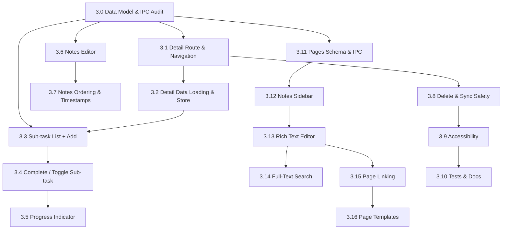

# Phase 3 — Productivity Depth

> **Goal:** Turn CourseFlow from a simple tracker into a productivity tool. Users can open any assignment, break it down into **sub-tasks**, and attach **notes / progress logs** — all persisted locally in SQLite and preserved across syncs and restarts. Additionally, users can create **standalone notes and pages** (Notion-style) independent of assignments, organized in a sidebar with nesting, rich text/markdown support, and full-text search.
>
> **Exit Criteria:** A user can click any assignment to open a detail view, add and complete sub-tasks with instant feedback, and write persistent notes/progress entries. Users can also navigate to a dedicated Notes workspace to create, organize, and search standalone pages. Backend data survives re-imports and app restarts.

---

## Overview

Phases 1 and 2 gave us a **tracker**: pull assignments from iCal, see them in a prioritized, filterable list, and mark them done. Phase 3 adds the **productivity layer** on top of that list:

1. **Open** → Click any assignment row to open a detail view (title, course, due date, description, status).
2. **Break down** → Split large assignments into smaller, actionable sub-tasks (e.g., "Outline essay", "Draft intro", "Cite sources").
3. **Check off** → Complete sub-tasks one by one with instant feedback and a visible progress indicator.
4. **Log progress (per-assignment)** → Add notes / a short journal per assignment (what's done, what's blocked, next steps).
5. **Standalone Notes Workspace** → A dedicated Notes view (accessible via sidebar) where users create pages, nest them hierarchically, write in rich text/markdown, and search across all content — completely independent of assignments.
6. **Keep it local** → All sub-tasks, assignment notes, and standalone pages live in SQLite, are never overwritten by an iCal re-sync, and survive restarts.

---

## Phase 3 Scope — What Needs to Be Done

### 🏗️ Head Start: Backend Already Exists

Much of the data layer was scaffolded in Phases 0–2 and is **ready to use** — Phase 3 is primarily a **frontend + integration** phase. Do **not** rebuild these:

| Piece | Location | Status |
| --- | --- | --- |
| `sub_tasks` table (FK → assignments, `ON DELETE CASCADE`) | DB migrations / schema | ✅ exists |
| `notes` table (1:1 or per-entry, FK → assignments) | DB migrations / schema | ✅ exists |
| `SubTask` / `Note` types + inputs | `src/backend/shared/types.ts` | ✅ exists |
| Repo CRUD (list/upsert/delete, subtask toggle) | `src/backend/main/db/repository.ts` | ✅ exists |
| IPC channels `db:subtasks:*`, `db:notes:*` | `src/backend/main/ipc-handlers.ts` | ✅ exists |
| Preload bridge (`window.api.db.subtasks.*`, `notes.*`) | `src/backend/preload/index.ts` | ✅ exists |
| `db:changed` events for sub-task/note mutations | events layer | ✅ exists (verify per-table) |

> ⚠️ **Audit first (Ticket 3.0):** confirm the schema/IPC/types match what the UI needs (e.g., sub-task ordering field, note `updated_at`, markdown content) before building the UI on top of it.

### Scope boundaries (what Phase 3 is *not*)

- ❌ Not the polish/packaging pass (that's Phase 4).
- ❌ Not reminders/notifications (Phase 5).
- ❌ Not multiple iCal feeds (Phase 6 — see `docs/roadmap.md`).
- ❌ Not a public-marketing detail pass on the whole UI.

---

## Proposed Ticket Breakdown

### ⚠️ BLOCKING PREREQUISITE (Do First)

| # | Ticket | Title | Description |
| --- | --- | --- | --- |
| 3.0 | `phase3-00-data-model-audit` | **Data Model & IPC Audit for Detail/Sub-tasks/Notes** | Audit `SubTask`/`Note` schema, types, repo, IPC, and preload against the UI requirements below. Fill gaps (ordering, timestamps, note model shape), add/align columns, and run a migration if needed. **All other tickets depend on this.** |

### A. Assignment Detail View (Frontend Foundation)

| # | Ticket | Title | Description |
| --- | --- | --- | --- |
| 3.1 | `phase3-01-detail-route` | Detail View Route & Navigation | Add `/assignments/:id` route + page. Assignment rows become clickable (keyboard accessible). Show title, course badge, due date (with overdue/all-day handling), description, status. |
| 3.2 | `phase3-02-detail-state` | Detail Data Loading & Store | Load a single assignment via `db:assignments:get`; hydrate sub-tasks + notes; subscribe to `db:changed` for live updates. Loading / error / not-found states. |

### B. Sub-Tasks

| # | Ticket | Title | Description |
| --- | --- | --- | --- |
| 3.3 | `phase3-03-subtask-core` | Sub-task List + Add | Render sub-tasks ordered; add new sub-task inline (Enter to save); delete with confirmation; optimistic UI + toast on failure. |
| 3.4 | `phase3-04-subtask-complete` | Complete / Toggle Sub-task | One-click complete/un-complete with instant feedback via `db:subtasks:toggle`; persisted. |
| 3.5 | `phase3-05-subtask-progress` | Progress Indicator | Show `x/y complete` + progress bar on the assignment row and/or detail header. Decide interplay with assignment status (e.g., prompt "Mark assignment complete?" when all sub-tasks are done). |

### C. Notes & Progress Logging (Per-Assignment)

| # | Ticket | Title | Description |
| --- | --- | --- | --- |
| 3.6 | `phase3-06-notes-core` | Notes Editor | Add/edit/delete notes per assignment. Decide markdown vs. plain text (design decision below); persist via `db:notes:*`. |
| 3.7 | `phase3-07-notes-history` | Note Ordering & Timestamps | Show newest-first log with timestamps; store `created_at`/`updated_at`; indicate edited notes. |

### D. Standalone Notes & Pages (Notion-style Workspace)

| # | Ticket | Title | Description |
| --- | --- | --- | --- |
| 3.11 | `phase3-11-notes-pages-schema` | **Pages Table Schema & IPC** | Create `pages` table with: `id`, `parent_id` (self-referential FK for nesting), `title`, `content` (JSON for block-based or markdown string), `icon`, `cover`, `created_at`, `updated_at`, `created_by`. Add `db:pages:*` IPC channels (list, get, create, update, delete, move, search) and preload bridge. Run migration v5. |
| 3.12 | `phase3-12-notes-sidebar` | Notes Sidebar & Navigation | Build collapsible sidebar (left panel) showing page tree with drag-and-drop reordering, create page/folder, rename, delete, duplicate. Persist expanded/collapsed state per folder. Keyboard navigation (arrows, Enter to open). |
| 3.13 | `phase3-13-notes-editor` | Rich Text / Markdown Editor | Implement editor for page content. MVP: markdown textarea with live preview (split view) + toolbar (headings, bold, italic, code, lists, links). Future: block-based editor (TipTap/Slate). Auto-save on change (debounced). |
| 3.14 | `phase3-14-notes-search` | Full-Text Search | Add SQLite FTS5 virtual table for `pages` content. Implement search IPC (`db:pages:search`) with ranking. UI: cmd+k / cmd+shift+p style command palette for quick search + dedicated search results view. |
| 3.15 | `phase3-15-notes-linking` | Page Linking & Backlinks | Support `[[page title]]` wiki-style links in markdown. Auto-create backlinks panel showing "Linked from" references. Click to navigate. |
| 3.16 | `phase3-16-notes-templates` | Page Templates | Pre-built templates (Class Notes, Meeting Notes, Project Plan, Daily Journal). Template picker on new page creation. Custom templates saved by user. |

### E. Integration & Polish

| # | Ticket | Title | Description |
| --- | --- | --- | --- |
| 3.8 | `phase3-08-cascade-safety` | Delete & Sync Safety | Deleting an assignment cascades sub-tasks/notes (verify FK). iCal re-import must **never** touch sub-tasks/notes (reuse protected-fields logic). Manual assignments (source `manual`) also get detail view. |
| 3.9 | `phase3-09-accessibility` | Accessibility & Keyboard | Keyboard nav to detail, complete sub-task with Space/Enter, focus management on modal/route change, ARIA for progress. |
| 3.10 | `phase3-10-tests-docs` | Tests & Docs | Unit tests (sub-task/note repo+IPC), component tests (detail view, sub-task flow, notes), update `docs/architecture/data-model.md` + `ipc-contract.md`, root README phase badge. |

---

## Non-Coding Actions & Design Decisions (Resolve Early)

### Architecture & Product Decisions

- [ ] **Detail view: route vs. modal** — A `/assignments/:id` route (deep-linkable) vs. an in-page panel/modal. **Recommendation:** route for Phase 3 (consistent with existing router, allows future share/links and easy state reset).
- [ ] **Note format** — Plain text vs. markdown. No markdown dependency exists yet. **Recommendation:** plain multi-line text with a lightweight markdown renderer later; decide before Ticket 3.6.
- [ ] **Sub-task ↔ assignment status** — Does completing all sub-tasks auto-complete the assignment? **Recommendation:** show a gentle inline prompt, let the user decide (avoid surprising auto-complete).
- [ ] **Sub-task reordering** — Do users reorder sub-tasks (drag/up-down)? MVP scope: keep creation order; add ordering later unless trivial.
- [ ] **Notes model shape** — Single note per assignment vs. multiple timestamped log entries. **Recommendation:** multiple entries (matches "progress logging" language) unless schema audit shows otherwise.

### Product / Data

- [ ] Confirm deletion UX for assignments that have sub-tasks/notes (confirm dialog, cascade).
- [ ] Verify re-import conflict rules: sub-tasks/notes live in separate tables and are never overwritten by iCal (Phase 1 decision) — add a regression test.

### Process & Hygiene

- [ ] Re-run the full test suite + a live smoke test (fetch → open detail → add/complete sub-task → add note → restart → still there).
- [ ] Add Phase 3 manual-testing notes once the UI lands (real calendar data, multi-course).

---

## Deliverables Checklist

By the end of Phase 3:

### Backend (Main Process)

- [ ] Schema/migration v4 if the audit (3.0) found gaps (e.g., sub-task position, note timestamps)
- [ ] Schema/migration v5 for `pages` table (3.11): hierarchical structure, content, FTS5 search index
- [ ] Repo + IPC + preload aligned with final types (audit output)
- [ ] `db:changed` events verified for `sub_tasks`, `notes`, and `pages`

### Frontend (Renderer)

- [ ] Assignment rows are clickable → detail view (`/assignments/:id`)
- [ ] Detail view: header info (title/course/due/status/description)
- [ ] Sub-task list: add, complete/un-complete, delete, ordered, progress indicator
- [ ] Assignment Notes: add/edit/delete, newest-first log with timestamps
- [ ] **Notes Workspace**: Sidebar with nested page tree, drag-drop reorder, create/rename/delete/duplicate
- [ ] **Page Editor**: Markdown editor with live preview, toolbar, auto-save
- [ ] **Search**: Command palette + search results view with FTS5 ranking
- [ ] **Linking**: Wiki-style `[[links]]` with backlinks panel
- [ ] Optimistic updates + error toasts; loading/empty/not-found states
- [ ] Keyboard + screen-reader support for all new interactions

### Integration

- [ ] End-to-end: sync iCal → open assignment → add sub-tasks → complete them → restart → state persists
- [ ] End-to-end: iCal re-import does not wipe sub-tasks/notes/pages
- [ ] End-to-end: assignment delete cascades sub-tasks/notes cleanly
- [ ] End-to-end: page delete cascades children; move updates hierarchy
- [ ] Existing filters/sort/group + priority drag-drop unaffected by the new UI

### Documentation

- [ ] Phase 3 tickets created in `docs/tickets/phase3/`
- [ ] `docs/architecture/data-model.md` updated (sub-task/note model + pages model + protected fields)
- [ ] `docs/architecture/ipc-contract.md` updated with any new channels
- [ ] Root README updated with current phase

---

## Ticket Dependency Graph

---

## Reference

- Roadmap: `docs/roadmap.md` → **Phase 3 — Productivity Depth** (M3 milestone)
- Backend wiring already present: `src/backend/shared/types.ts`, `src/backend/main/db/repository.ts`, `src/backend/main/ipc-handlers.ts`, `src/backend/preload/index.ts`
- Prior phase READMEs for format/process: `docs/tickets/phase1/README.md`, `docs/tickets/phase2/README.md`
